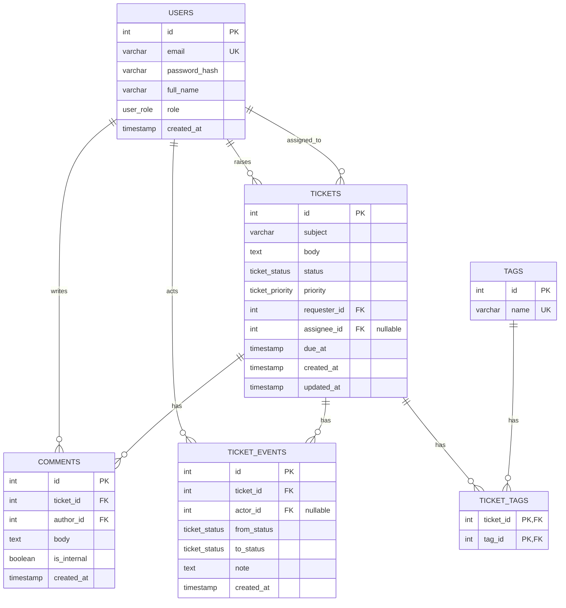

# Support Desk ERD

```mermaid
erDiagram
    USERS ||--o{ TICKETS : raises
    USERS ||--o{ TICKETS : assigned_to
    USERS ||--o{ COMMENTS : writes
    TICKETS ||--o{ COMMENTS : has
    USERS ||--o{ TICKET_EVENTS : acts
    TICKETS ||--o{ TICKET_EVENTS : has
    TICKETS ||--o{ TICKET_TAGS : has
    TAGS ||--o{ TICKET_TAGS : has

    USERS {
        int id PK
        varchar email UK
        varchar password_hash
        varchar full_name
        user_role role
        timestamp created_at
    }

    TICKETS {
        int id PK
        varchar subject
        text body
        ticket_status status
        ticket_priority priority
        int requester_id FK
        int assignee_id FK "nullable"
        timestamp due_at
        timestamp created_at
        timestamp updated_at
    }

    COMMENTS {
        int id PK
        int ticket_id FK
        int author_id FK
        text body
        boolean is_internal
        timestamp created_at
    }

    TAGS {
        int id PK
        varchar name UK
    }

    TICKET_TAGS {
        int ticket_id PK, FK
        int tag_id PK, FK
    }

    TICKET_EVENTS {
        int id PK
        int ticket_id FK
        int actor_id FK "nullable"
        ticket_status from_status
        ticket_status to_status
        text note
        timestamp created_at
    }
```